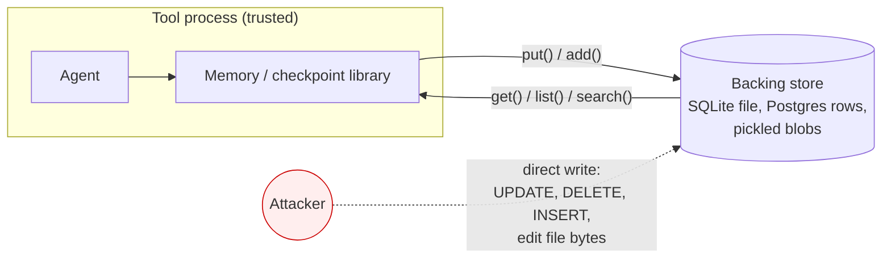
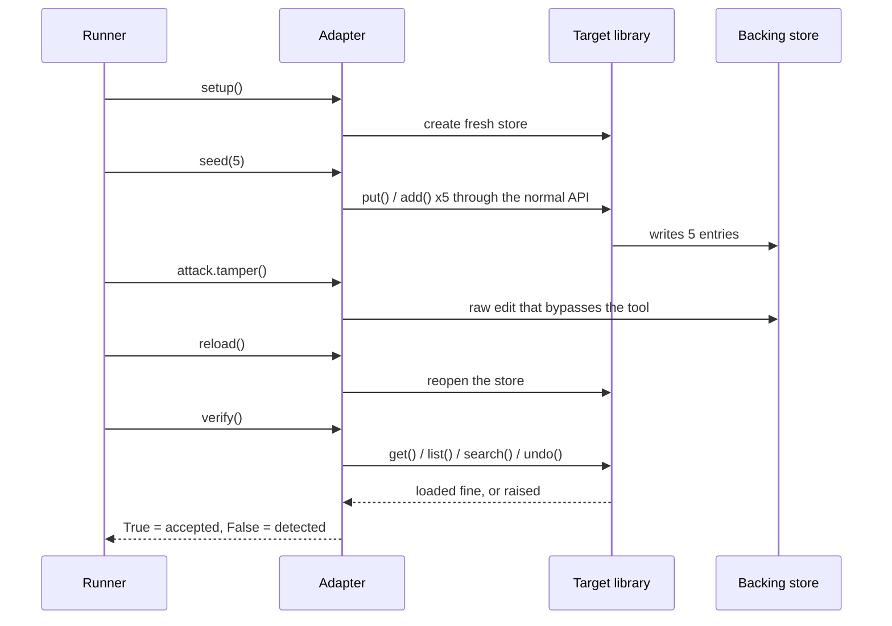
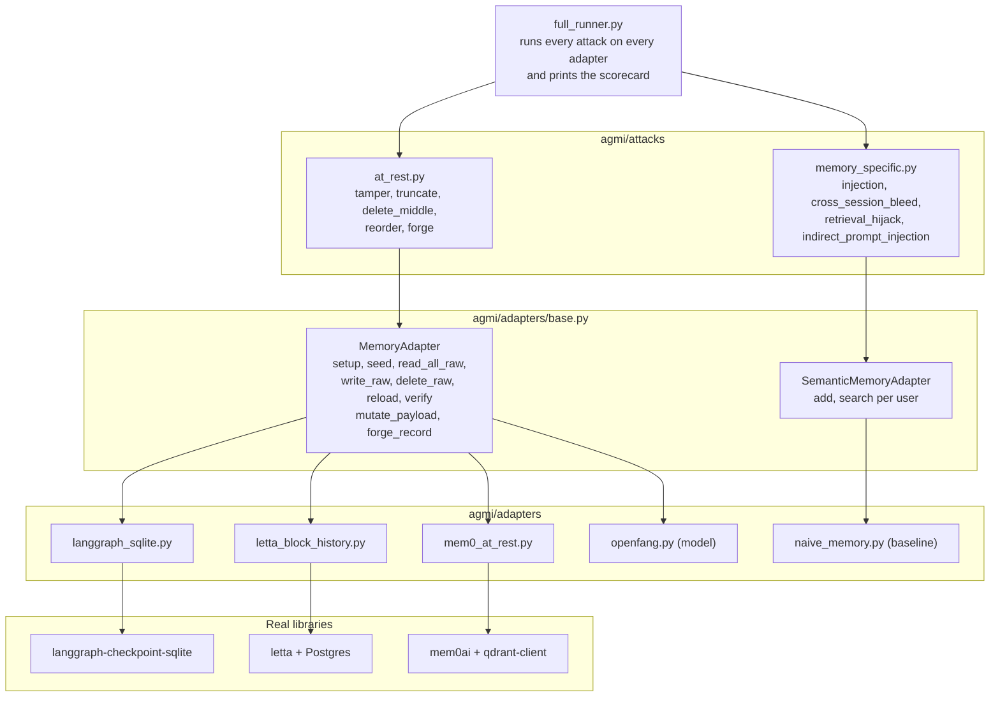

<p align="center">
  
</p>

<h1 align="center">agmi</h1>
<p align="center"><strong>Agent Memory Integrity</strong><br>
A conformance test suite that measures whether AI agent memory and checkpoint stores notice when they are tampered with.</p>

<p align="center">
  <a href="https://github.com/tech4biz-yasha/agmi/actions/workflows/scorecard.yml"></a>
  <a href="LICENSE"></a>
  
  
</p>

---

## The result in one table

Three of the most used agent memory layers were seeded through their own APIs, edited behind their backs, and asked to read their memory again. None of them noticed.

| Target | Version | tamper | truncate | delete_middle | reorder | forge |
|---|---|:-:|:-:|:-:|:-:|:-:|
| LangGraph `SqliteSaver` | langgraph-checkpoint-sqlite 3.1.1 | accepted | accepted | accepted | accepted | accepted |
| Letta core memory checkpoint history | letta 0.16.8 | accepted | accepted | accepted | accepted | accepted |
| Mem0 local Qdrant store | mem0ai 2.0.20 | accepted | accepted | accepted | accepted | accepted |
| inspeximus, receipts off (default), read path | inspeximus 2.38.0 | accepted | accepted | accepted | accepted | accepted |
| inspeximus, receipts on with a key, attacker holds the store's directory | inspeximus 2.38.0 | reported | reported | reported | reported | reported |
| inspeximus, receipts on with a key, attacker also holds the user's config home | inspeximus 2.38.0 | reported | accepted | reported | reported | reported |

"Accepted" means the tool loaded the altered store, raised nothing, and the agent carried on from the altered memory as if it were true. "Reported" means the tool's own integrity check named the problem after a reload; the inspeximus rows say which call that is. Every row is a measurement of the real library at the version shown, reproducible in under a minute, and pinned by a test that fails the day that library adds a check.

This is a design gap, not a bug. LangGraph, Letta and Mem0 do not claim their stores are tamper evident. inspeximus makes that claim for its receipts mode, and the table shows what that buys and where it stops. The point of agmi is that nobody had measured the gap with one yardstick, and that the gap matters the moment agent memory is used as a record.

## Quick start

```bash
git clone https://github.com/tech4biz-yasha/agmi && cd agmi
python3 -m venv .venv && source .venv/bin/activate
pip install -e ".[dev,langgraph,letta,mem0,inspeximus]"
PYTHONPATH=. python3 agmi/full_runner.py 2>/dev/null | grep "|"
```

Everything runs offline. No API keys, no model downloads, no Docker. The Letta row starts an embedded Postgres through `pgserver`; set `LETTA_PG_URI` if you would rather point it at your own.

## Contents

1. [Why this exists](#why-this-exists)
2. [Threat model](#threat-model)
3. [How one measurement works](#how-one-measurement-works)
4. [Architecture](#architecture)
5. [Attack catalogue](#attack-catalogue)
6. [Targets and what each measurement means](#targets-and-what-each-measurement-means)
7. [Reading the scorecard honestly](#reading-the-scorecard-honestly)
8. [Writing an adapter](#writing-an-adapter)
9. [Roadmap](#roadmap)
10. [Contributing, security, citation](#contributing-security-citation)

## Why this exists

Agent frameworks persist two kinds of state so an agent survives a restart: execution checkpoints (where the graph was, what each channel held) and long term memory (facts about the user, past decisions, retrieved context). Both are written to a database or a file and read back later as truth.

These stores were built for recovery. Recovery asks "can I load this?". Integrity asks "is this what was written?". Almost every store answers the first question and never asks the second. That is fine while the store is as trusted as the process. It stops being fine when:

- the memory is the audit trail (finance, healthcare, compliance, anything with a regulator);
- the store is shared infrastructure reachable by more than the agent (multi tenant hosting, a Postgres several services share, a mounted volume);
- an agent's past decisions are replayed to justify its next one;
- a lower privileged process, backup job or migration script can write where the agent reads.

agmi exists to give one common yardstick for that second question, across tools, with numbers a maintainer can reproduce and a buyer can compare.

## Threat model

The attacker has write access to the backing store and nothing else.



Concretely the attacker can:

- run SQL against the tool's database;
- rewrite bytes inside a file the tool reads;
- insert rows that look like the tool wrote them.

The attacker cannot:

- run code inside the tool's process;
- see or use keys the tool holds only in memory;
- change the tool's source.

This is the "database compromise or privileged write at rest" model. It is the model behind the real checkpointer deserialization CVEs, and it is the model a compliance reviewer assumes when they ask whether a log can be rewritten.

## How one measurement works

Every cell in the scorecard is produced by the same four steps. The tool's own API is used on both sides of the tampering, so the result is the tool's answer, never ours.



The pass/fail rule is deliberately narrow. A tool is **detected** only if it raises, refuses or reports the problem itself on reload. A tool that loads the altered store and answers normally is **accepted**. We never infer detection from the content coming back different, because the tool did not say anything.

## Architecture

Attacks are written once against a small adapter interface. Each target gets one adapter that knows where its data lives and how to edit it raw. Adding a tool is one file; the attacks do not change.



Folder map:

```
agmi/
  attacks/
    base.py                 Attack contract and AttackResult (detected / accepted / n/a / error)
    at_rest.py              The five at-rest attacks, written once for every adapter
    memory_specific.py      The four retrieval attacks for user-scoped semantic memory
  adapters/
    base.py                 MemoryAdapter interface plus the two payload hooks
    semantic_base.py        SemanticMemoryAdapter interface for retrieval tools
    langgraph_sqlite.py     Real LangGraph SqliteSaver
    letta_block_history.py  Real Letta core memory checkpoint history (Postgres)
    mem0_at_rest.py         Real Mem0 on its local Qdrant store, offline
    openfang.py             Python model of OpenFang's hash-chained audit log
    naive_memory.py         Deliberately undefended retrieval baseline
  full_runner.py            Builds the matrix and prints the scorecard
tests/                      One pinned test module per real target
.github/workflows/          Scorecard on every push, plus weekly re-measurement
```

## Attack catalogue

Each attack has one precise rule. There are no heuristics and no scoring thresholds in the at-rest set.

| Attack | What the attacker does to the store | Detected means | Why it matters |
|---|---|---|---|
| `tamper` | Changes the content of one entry in the middle, without breaking its encoding | Tool refuses or flags the entry on reload | Silent rewriting of a past memory or decision |
| `truncate` | Deletes the newest two entries | Tool notices the chain ends early | Rolling an agent back to an older state and erasing recent actions from the record |
| `delete_middle` | Removes one entry from the middle | Tool notices a hole in the sequence | Erasing one inconvenient event from a history that still looks continuous |
| `reorder` | Swaps the content of two entries | Tool notices the sequence is out of order | Changing what happened before what |
| `forge` | Inserts a fabricated entry after the tip, with a valid looking id and parent | Tool rejects the unsigned or unchained entry | Planting a memory or checkpoint the agent then resumes from |

The memory-specific set asks a different question, "did attacker content reach the agent or cross a user boundary", and applies only to user-scoped retrieval tools:

| Attack | Question it answers |
|---|---|
| `memory_injection` | Does a planted memory later retrieve as fact for an innocent query? |
| `cross_session_bleed` | Can user B retrieve what user A stored? |
| `retrieval_hijack` | Can an entry be crafted to surface for unrelated queries? |
| `indirect_prompt_injection` | Does instruction-shaped stored content get delivered into retrieved context? |

`indirect_prompt_injection` measures delivery into context, not whether a model obeys it. A portable suite cannot drive every tool's live model; delivery is the property the tool owns.

## Targets and what each measurement means

### LangGraph `SqliteSaver`

| | |
|---|---|
| Measured on | langgraph-checkpoint-sqlite 3.1.1, langgraph-checkpoint 4.2.0 |
| What is targeted | The `checkpoints` table: one row per checkpoint, msgpack blob, parent id, time-ordered UUID |
| Seeded through | `SqliteSaver.put()` |
| Read back through | `SqliteSaver.get()` and `list()` |
| verify() | True if the thread loads and every row deserializes |

There is no integrity logic on the store. The only thing that can fail on reload is deserialization, so a tamper that keeps the msgpack valid is invisible. After `forge` the agent resumes from the attacker's checkpoint.

### Letta core memory checkpoint history

| | |
|---|---|
| Measured on | letta 0.16.8 (Postgres only since 0.13; embedded via pgserver here) |
| What is targeted | `block_history`: one row per checkpoint of a core memory block with a `sequence_number`, plus `block.current_history_entry_id` |
| Seeded through | `BlockManager.create_or_update_block_async`, `update_block_async`, `checkpoint_block_async` |
| Read back through | `get_block_by_id_async`, then `undo_checkpoint_block` to the start and `redo_checkpoint_block` back |
| verify() | True if Letta raises nothing during the full undo and redo walk |

Letta's undo and redo are written to tolerate missing sequence numbers, so a holed or truncated history is invisible by design. After `truncate` the agent's core memory silently rewinds two checkpoints and every call succeeds. After `forge` the agent's core memory is the attacker's text.

### Mem0 local Qdrant store

| | |
|---|---|
| Measured on | mem0ai 2.0.20, qdrant-client local mode |
| What is targeted | `points` table of the on-disk Qdrant collection (one pickled `PointStruct` per memory) and Mem0's `history` SQLite table |
| Seeded through | `Memory.add(infer=False)` with a deterministic offline embedder |
| Read back through | `get_all()`, `search()`, `history()` |
| verify() | True if all three succeed |

Mem0 writes an ADD event to `history` for every memory and stores an md5 of each memory's text. Neither is checked: the hash is for de-duplication and the history is never reconciled with the vector store. After `truncate` the history still lists five memories while the agent can see three, and Mem0 reports nothing.

The memory-specific columns stay `n/a` for Mem0 because retrieval ranking under the offline embedder would measure our embedder, not Mem0.

### inspeximus

| | |
|---|---|
| Measured on | inspeximus 2.38.0. Receipts rows: `Inspeximus(path, receipts=True, receipt_key=sk)` with a fresh Ed25519 key. Default row: `Inspeximus(path)` |
| What is targeted | The `records` table of the SQLite store, one JSON document per memory, and `<store>.receipts.json`, the signed hash chain of write receipts, both in the store's directory. In the third row also the chain head the store keeps in the user's config home |
| Seeded through | `remember(text, key=...)` |
| Read back through | Receipts rows: `verify_writes(expected_pubkey=pk)`, the store's own audit method (also its `verify_writes` MCP tool). Default row: the store loads, `recall()` answers, `history()` answers |
| verify() | Receipts rows: True if the receipt chain recomputes, every stored record matches its receipt, and the chain is not shorter than the head kept outside the directory. Default row: True if the read path raises nothing |

Three rows, because the answer depends on the configuration and on what the attacker holds. Receipts are off on a fresh store. Off, nothing checks the rows and the store reads like LangGraph: five accepted. Off, `verify_writes()` also refuses to vouch for any store, touched or not, which would score every attack "reported" for the wrong reason, so the receipts rows seed with receipts on and a fresh key.

With receipts on, each write gets a receipt that commits to the record's text, key, type and attribution, chained by hash to the previous receipt and signed, and the store writes the chain's head (first receipt, count, tip) to the user's config home after every receipt. `verify_writes()` recomputes the chain, compares each stored record with its receipt, and compares the chain on disk with that head; the named-tamper test shows the altered row's id in the problems list. The second row is the README's attacker, write access to the backing store: the SQLite file and the receipts sidecar. Tamper, reorder and forge are reported because the receipts are signed and the attacker has no key. `delete_middle` is reported because the receipt after the gap names the missing one as its predecessor, and that link is inside the signed payload. `truncate` is reported because the chain is shorter than the head, and the agent's own later writes do not lower the head.

The third row gives the attacker the config home as well, so the head goes with the cut. Four stay reported; `truncate` is accepted: a tail cut with its receipts leaves a shorter chain that is internally consistent, and no file outside the attacker's reach records the earlier length. Any anchor the same user account can write, wherever it sits, shares that limit; only an anchor off the machine does not. The remedy inspeximus offers for it is `anchor()` handed to a witness plus `verify_consistency()`; a test in `tests/test_inspeximus_rows.py` shows an anchor taken earlier reporting `write log shrank: 3 < anchored 5`. agmi does not model an anchor off the machine, so the cell stays accepted.

Two limits to read the receipts rows by. Detection is the audit call: after any of the five attacks the store still loads and `recall()` serves the altered record, as with the other targets. And a receipt commits to text, key, type and attribution; an at-rest edit to a field outside that set, such as the timestamp, verifies clean.

The adapter is `agmi/adapters/inspeximus_rows.py`; `pip install -e ".[inspeximus]"` (the extra pulls `inspeximus[crypto]`, since Ed25519 signing needs the `cryptography` package).

### Reference rows

`openfang(model,fixed)` is a Python re-implementation of OpenFang's hash-chained audit log, including the tip persistence fix from [openfang PR #1287](https://github.com/RightNow-AI/openfang/pull/1287). It proves the five attacks are detectable by a chained store. It is not a measurement of the Rust binary.

`naive-mem` is a deliberately undefended retriever. A "safe" from it is a weak signal and exists only so the memory-specific attacks have something to run against until real retrieval adapters land.

## Reading the scorecard honestly

- **`n/a` is information.** Which attacks apply depends on what a tool claims to be. An audit log cannot be memory-injected; a bare vector store has no chain to truncate. No tool faces all nine. The map of which cells apply is part of the finding.
- **"Accepted" is not "vulnerable to remote attack".** The attacker already has store access. The question is only whether the tool can tell.
- **Model rows are labelled.** Anything not measured against the real library says `(model)` in its name and is excluded from the headline table.
- **Versions are pinned.** Each real target has a test asserting the measured result at the measured version. When a maintainer adds a check the test fails, the CI goes red, and the scorecard gets updated with the new version and a note. The weekly CI run does this against the latest release without anyone needing to remember.

## Writing an adapter

One file. Implement `MemoryAdapter` from `agmi/adapters/base.py`:

```python
class MyToolAdapter(MemoryAdapter):
    name = "mytool-store"

    def setup(self): ...          # fresh, isolated store in a temp dir or scratch db
    def teardown(self): ...
    def seed(self, n): ...        # write n entries through the TOOL'S OWN API
    def read_all_raw(self): ...   # list[Record] in chain order, raw fields, bypassing the tool
    def write_raw(self, rec): ... # write one Record back, raw
    def delete_raw(self, seq): ...
    def reload(self): ...         # reopen the store the way a restart would
    def verify(self): ...         # the TOOL'S answer: True loaded fine, False it complained

    # Optional hooks for blob-based stores
    def mutate_payload(self, rec): ...  # change meaning without breaking encoding
    def forge_record(self, tmpl): ...   # a plausible new tip with a valid-looking id
```

Rules that keep a row honest:

1. Seed and verify through the tool's public API, never through the raw store.
2. `verify()` reports what the tool says. Do not compare content and call a difference "detected".
3. Pin the version in a test, as `tests/test_langgraph_sqlite.py` does.
4. If the target needs a hosted model or an API key to run, nobody can reproduce it; find an offline path or mark the cell `n/a` with a reason.
5. Label anything that is not the real library `(model)`.

Then add the adapter to `full_runner.py` and open a PR with the new scorecard row.

## Roadmap

| Version | Scope | Status |
|---|---|---|
| 0.1 | Attack catalogue, adapter interface, OpenFang model, naive baseline | done |
| 0.2 to 0.5 | Real at-rest measurements for LangGraph, Letta and Mem0; licensing; CI | done |
| 0.6 | Memory-specific attacks on real retrieval tools with real embedders (Mem0, Graphiti) | next |
| 0.7 | Deserialization safety: crafted stored payloads that execute on load. Both LangGraph and Mem0 still unpickle from their stores, and one has patched a version of this before | planned |
| 0.8 | In-flow attacks: replay, cross-thread poison, rollback during execution | planned |
| 0.9 | Reference integrity layer: a hash chain in checkpoint metadata, offered upstream as an optional mode | planned |
| 1.0 | Stable adapter interface, published conformance levels, monthly report cadence | planned |

## Contributing, security, citation

- Contributions: see [CONTRIBUTING.md](CONTRIBUTING.md). New real-library adapters are the most valuable thing you can send.
- Security: agmi finds design gaps and discusses them in public. If you find an actual vulnerability in a target using this suite, see [SECURITY.md](SECURITY.md) and do not open a public issue.
- Changes: [CHANGELOG.md](CHANGELOG.md).

If you use agmi in a paper, a review or a procurement decision, cite it:

```
Yasha Khandelwal (2026). agmi: Agent Memory Integrity, a conformance test suite for
tamper evidence in AI agent memory and checkpoint stores. https://github.com/tech4biz-yasha/agmi
```

MIT licensed. Copyright (c) 2026 Yasha Khandelwal, yasha.khandelwal@tech4biz.io.
